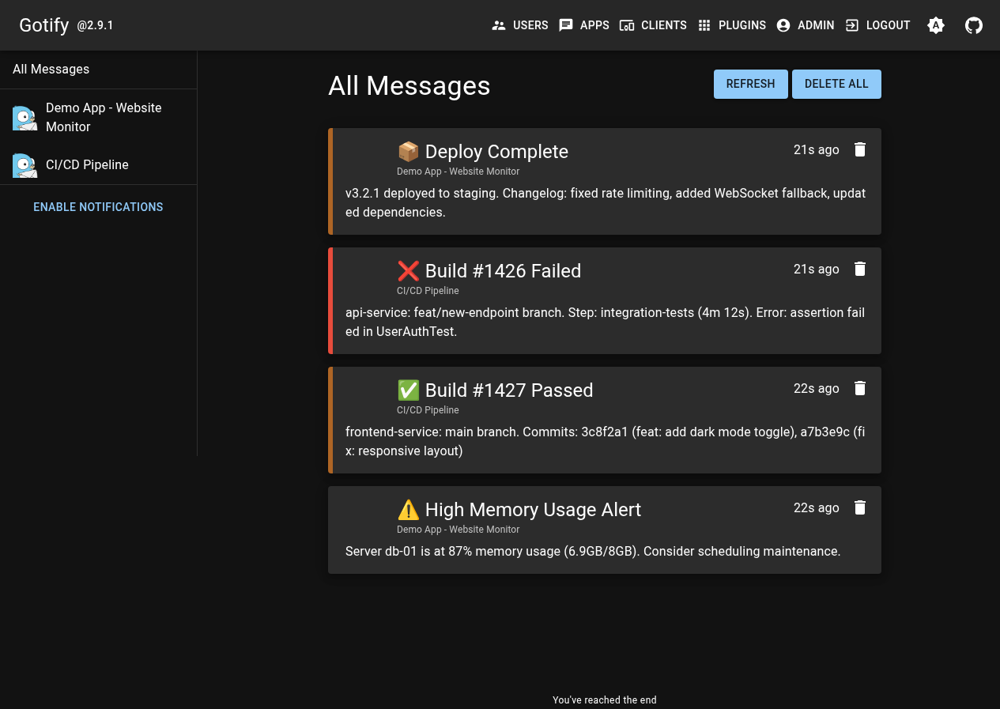
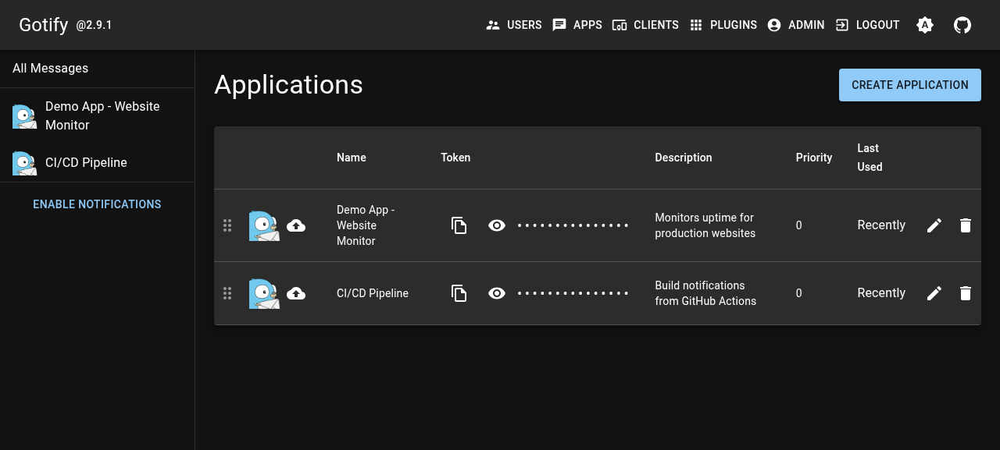
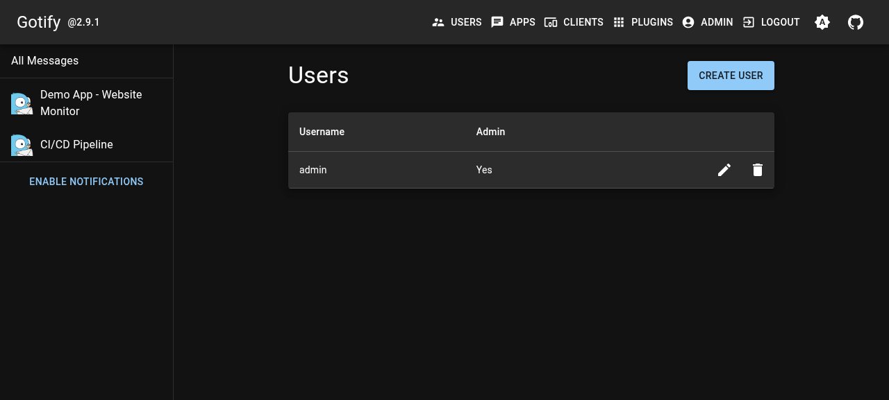

<div align="center">
  
  <h1 align="center">Gotify</h1>
  <p align="center">A self-hosted push notification server for sending & receiving messages.</p>
</div>

<p align="center">
  <a href="https://railway.com/template/gotify"></a>
  <a href="https://github.com/gotify/server"></a>
  <a href="https://github.com/gotify/server/blob/master/LICENSE"></a>
</p>

<div align="center">
  
</div>

---

## 📸 Screenshots

| Messages Timeline | Registered Applications | User Management |
|:---:|:---:|:---:|
|  |  |  |

*Live demo at [gotify-production-5fcc.up.railway.app](https://gotify-production-5fcc.up.railway.app)*

---

## ✨ Features

- **Push Notifications** — Send notifications to your devices from any application or script
- **REST API** — Simple HTTP API for programmatic message sending
- **Web Interface** — Built-in admin UI for managing users, apps, and clients
- **Multi-Platform Clients** — Android app, WebSocket, and CLI tools available
- **User Management** — Multi-user support with permission controls
- **Message Priorities** — Assign priority levels to notifications
- **Plugin System** — Extend functionality with community plugins
- **Lightweight** — Single Go binary, ~12MB, runs on minimal resources

## 🚀 Deploy on Railway

### One-Click Deploy

[](https://railway.com/template/gotify)

Click the button above to deploy Gotify instantly on Railway.

### Prerequisites

- A [Railway](https://railway.com) account
- (Optional) A [Postgres](https://railway.com?referral=postgres) plugin for production database — or use the built-in SQLite

## ⚙️ Environment Variables

| Variable | Required | Default | Description |
|----------|----------|---------|-------------|
| `PORT` | No | `8080` | HTTP listen port (must match Dockerfile EXPOSE) |
| `GOTIFY_SERVER_BINDADDRESS` | No | `0.0.0.0` | Server bind address |
| `GOTIFY_DEFAULTUSER_NAME` | No | `admin` | Default admin username (first-run only) |
| `GOTIFY_DEFAULTUSER_PASS` | No | `admin` | Default admin password (first-run only) |
| `GOTIFY_DATABASE_DIALECT` | No | `sqlite3` | Database type: `sqlite3`, `mysql`, or `postgres` |
| `GOTIFY_DATABASE_CONNECTION` | No | `data/gotify.db` | Database connection string |
| `GOTIFY_REGISTRATION` | No | `false` | Allow public user registration |
| `GOTIFY_SERVER_LOG_LEVEL` | No | `info` | Log level: `debug`, `info`, `warning`, `error` |
| `GOTIFY_FILE_SIZE` | No | `20` | Max upload size in MB |
| `GOTIFY_UPLOADEDIMAGES_DIR` | No | `data/images` | Uploaded images directory |

### 🔒 Recommended Production Configuration

For production deployments, Railway automatically generates the `RAILWAY_PUBLIC_DOMAIN` variable. Gotify will bind to the provided port and Railway handles TLS termination at the edge.

**Change your admin password immediately after first login.**

## 📡 Service Dependencies

```
┌──────────────────────────────────────────────────────┐
│                     Gotify Server                     │
│                      Port 8080                        │
├─────────────────┬──────────────────┬─────────────────┤
│   SQLite (file) │  REST API (/ )   │   Web UI (/ )   │
│  (default,      │  POST /message   │  Manage apps,   │
│   persistent)   │  GET /health     │  users, clients  │
└─────────────────┴──────────────────┴─────────────────┘
        │                    │                   │
        │              ┌─────┴──────┐           │
        │              │            │            │
   ┌────┴─────┐  ┌────┴────┐  ┌────┴────┐  ┌────┴────┐
   │ Android  │  │  CLI    │  │ WebSocket│  │ Plugins │
   │  Client  │  │  gotify │  │  Clients │  │ (opt.)  │
   └──────────┘  └─────────┘  └─────────┘  └─────────┘
```

### Using with Railway Postgres Plugin

1. Add a **Postgres** plugin to your Railway project
2. Set these environment variables:
   ```
   GOTIFY_DATABASE_DIALECT=postgres
   GOTIFY_DATABASE_CONNECTION=${{Postgres.DATABASE_URL}}
   ```
3. Redeploy — Gotify will auto-migrate to PostgreSQL

## 💻 Local Development

### Prerequisites

- Docker installed on your machine

### Quick Start

```bash
# Clone the repository
git clone https://github.com/INAPP-Mobile/railway-gotify.git
cd railway-gotify

# Build and run with Docker
docker build -t gotify-server .
docker run -d \
  --name gotify \
  -p 8080:8080 \
  -e GOTIFY_DEFAULTUSER_NAME=admin \
  -e GOTIFY_DEFAULTUSER_PASS=admin \
  -v gotify-data:/app/data \
  gotify-server

# Open in browser
open http://localhost:8080
```

### Using Docker Compose

```yaml
services:
  gotify:
    build: .
    ports:
      - "8080:8080"
    environment:
      - GOTIFY_DEFAULTUSER_NAME=admin
      - GOTIFY_DEFAULTUSER_PASS=admin
      - GOTIFY_DATABASE_DIALECT=sqlite3
      - GOTIFY_DATABASE_CONNECTION=data/gotify.db
    volumes:
      - gotify-data:/app/data
    healthcheck:
      test: ["CMD", "wget", "-qO-", "http://localhost:8080/health"]
      interval: 30s
      timeout: 3s
      retries: 3
      start_period: 10s

volumes:
  gotify-data:
```

### Sending Test Messages

Once Gotify is running, send a test notification:

```bash
# Using curl
curl -X POST "http://localhost:8080/message?token=YOUR_APP_TOKEN" \
  -F "title=Hello" \
  -F "message=This is a test notification" \
  -F "priority=5"
```

## 🔧 Troubleshooting

| Issue | Solution |
|-------|----------|
| **Health check failing** | Ensure `PORT` environment variable matches `8080`. Check Railway logs for startup errors. |
| **Data lost on restart** | Gotify stores SQLite data in `/app/data/`. Railway provides ephemeral storage — database is persisted within the service's filesystem. For production, use Railway Postgres plugin. |
| **Cannot log in** | Default credentials: `admin` / `admin`. If you changed them and forgot, reset by clearing the database. |
| **Port conflict** | Ensure only one service uses port 8080. Change `PORT` environment variable if needed. |
| **Slow first startup** | The Docker image is ~12MB. First pull may take a moment on cold starts. |
| **404 on API endpoints** | Verify you're using the correct path. API base is `/`. Full endpoint: `POST /message`. |

## 📚 Resources

- **[Gotify Documentation](https://gotify.net/docs/)** — Official docs
- **[Gotify API Reference](https://gotify.net/api-docs)** — REST API documentation
- **[GitHub Repository](https://github.com/gotify/server)** — Source code & issues
- **[Android Client](https://github.com/gotify/android)** — Mobile client for notifications
- **[CLI Tool](https://github.com/gotify/cli)** — Command-line interaction

## 📄 License

This template deploys [Gotify](https://github.com/gotify/server), which is licensed under the **MIT License**. See the [LICENSE](https://github.com/gotify/server/blob/master/LICENSE) file for details.

---

<p align="center">
  <sub>Built by <a href="https://github.com/INAPP-Mobile">INAPP-Mobile</a> — Deploy your own notification server in minutes.</sub>
</p>
